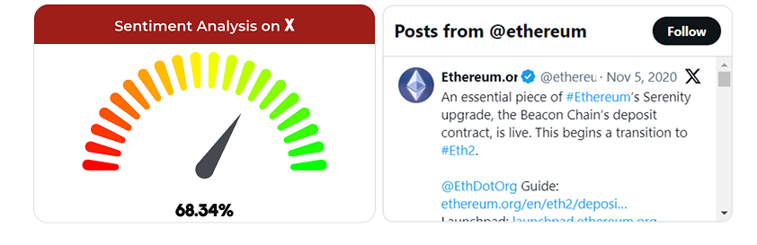

  

  

    <a href="https://www.youtube.com/watch?v=yWLr_TDu4Pw&ab_channel=DarshBaxi">View Demo</a>
    .<a href="https://sei-trage.vercel.app/">Deployed Link</a>
    .
    
    ·
    <a href="mailto:yashkudnar519@gmail.com">Contact us</a>
    ·
    <a href="https://github.com/Yash7426/SeiTrage/issues">Request Feature</a>
  

## Table of Contents

- [Introduction](#introduction)
- [Motivation](#motivation)
- [Tech Stack](#tech-stack)
- [Core Features](#core-features)
- [Concepts](#concepts)
- [Contributors](#contributors)

# Introduction

Seitrage is an **AI-powered cross-DEX arbitrage and analytics platform** built natively on the **Sei blockchain**. It combines a real-time **AI chat agent**, personalized **trending token insights**, and **Twitter/X sentiment analysis** with **on-chain DEX performance** to forecast high-potential opportunities. By leveraging **historical liquidity and volume data** alongside **social sentiment** and **short-term price predictions**, Seitrage refines arbitrage strategies and enables traders to act before spreads close. The platform introduces several **Sei-first enhancements**, including **Sei MCP integration** for AI-driven wallet actions such as **balance checks** and **SEI transfers**, **deBridge Widget integration** via **goat-sdk** for seamless **bridging and predictive forecasts**, and updated **liquid staking** support for **Silo (iSEI)** and **Kryptonite (stSEI)** to maximize yield while maintaining liquidity.

# SeiTrage Architecture

Seitrage is an AI-driven multi-DEX arbitrage platform optimized for Sei’s high-speed environment. Its data layer aggregates prices, order books, liquidity, oracle feeds, and social sentiment from Twitter/X and other sources. On top of this, the arbitrage engine applies predictive analytics and anomaly detection to identify short-lived pricing gaps, while the execution layer leverages Sei’s low latency for fast, capital-efficient trades. Cross-chain opportunities are enabled through deBridge, and idle assets are routed into iSEI and stSEI liquid staking to maximize yield between cycles. Together, these components create a seamless, automated pipeline—from data ingestion to profitable execution. 

# Motivation

The crypto ecosystem often exhibits short-lived price discrepancies across different DEXs and blockchains. Exploiting these arbitrage opportunities manually is challenging, especially considering the rapid market pace and cross-chain complexity. SeiTrage aims to automate this process using:

- **Predictive AI** to forecast potential price gaps
- **Sei’s high throughput** to ensure fast execution
- **deBridge integration** for cross-chain liquidity movement
- **Sei MCP integration** to perform AI-driven wallet actions, such as checking balances transferring SEI, and interacting with smart contracts directly from the platform
- **Trust-minimized smart contracts** to secure user funds
- **ZerePy integration** for efficient backtesting and strategy optimization
- **Allora Network integration** for short-term price prediction of major cryptocurrencies
- **Liquidity Staking** to fetch the best liquid staking yields for tokens

By streamlining the entire arbitrage lifecycle—data collection, analysis, and execution—SeiTrage helps traders capture fleeting opportunities efficiently.

# Tech Stack

**AI and Machine learning models:**
- **Python & ZerePy:**  
  - Automate data collection, tweet fetching, posting, and even token transfers on Sei.
  - Integrate ZerePy’s functions to streamline AI tasks.
- **Sei MCP**
  - Enable AI-driven wallet actions (query balances, transfer SEI, interact with smart  contracts) directly from the platform
- **Flask:**  
  - Serve as the backend server to orchestrate AI models, data pipelines, and API endpoints.
- **Prophet Model:**  
  - Used for forecasting future prices based on historical data.
- **Llama (LLM):**  
  - Fetch and analyze trending coins, leveraging its natural language capabilities.
- **Sentiment Analysis:**  
  - Analyze tweets related to specific coins and DEX performance to inform the AI predictions.

**Blockchain & Smart Contracts:**
- **Sei Blockchain:**  
  - EVM-compatible, high-performance network for executing trades.
- **deBridge:**  
  - Enables seamless cross-chain asset transfers.
- **Solidity, Hardhat/Foundry:**  
  - For developing, testing, and deploying smart contracts.

**Frontend:**
- **Next.js:**  
  - Framework for building a responsive, server-side rendered UI.
- **Drizzle & Ethers:**  
  - For interacting with smart contracts on the blockchain.
- **NextAuth & SWR:**  
  - Authentication and data fetching libraries for a smooth user experience.
- **Tailwind CSS & Radix-UI:**  
  - For fast, customizable, and accessible UI components.
- **ai-sdk:**  
  - For integrating additional AI-driven features directly into the frontend.
- **goat-sdk** 
  - Bridges AI workflows with DeFi primitives (deBridge, allora, wallet actions).  

# Core Features

Below is a breakdown of SeiTrage's features, designed to optimize the entire arbitrage flow:

### 1. **AI-Driven Prediction**
Analyze on-chain data (DEX volumes, order books, liquidity) and off-chain sentiment (social media, news) to forecast imminent price discrepancies. ZerePy’s machine learning models continually refine these predictions.

### 2. **Multi-DEX & Multi-Chain Integration**
Aggregate price data from multiple DEXs (e.g., Uniswap, SushiSwap) and across different blockchains. deBridge ensures smooth token transfers between SEI and other chains for broader arbitrage opportunities.

### 3. **Twitter Sentiment Analysis**

The Twitter Sentiment Analysis feature uses ZerePy to scrape and analyze tweets on specific coins and DEX performance, deriving sentiment scores to enhance the predictive model with real-time market trends, improving arbitrage accuracy.

### 4. **AI-Powered Chat Agent**  

The AI-powered chat agent enables users to get quick responses and real-time information on any coin and the broader Web3 ecosystem. Utilizing advanced NLP models, it understands queries and fetches relevant data from blockchain analytics, exchange data, and sentiment analysis tools. By providing instant insights and trend analysis, it enhances user decision-making, making SeiTrage a powerful tool for Web3 traders and investors.

### 5. **Sei MCP Integration**  

#### a. Sei MCP Server
•⁠  ⁠Provides blockchain services—including reading chain state (blocks, balances, transactions), interacting with smart contracts, transferring tokens (native, ERC20, ERC721, ERC1155), and accessing token metadata—through standardized MCP tools and resources.

#### b. MCP Client within Chat
•⁠  ⁠Captures natural-language input in the chat.  
•⁠  ⁠Maps user intent to the correct MCP tools (e.g., ⁠ get-balance ⁠).  
•⁠  ⁠Invokes these tools on the MCP server and returns formatted responses directly in the chat interface. 

##### Why It Matters
•⁠  ⁠*Natural language control*: End users don’t need to understand blockchain APIs or write code.  
•⁠  ⁠*AI-friendly integration*: Easily extended and discoverable by conversational AI assistants.

### 6. **Personalized Trending Tokens**  

This feature suggests trending tokens based on the social media activity of people you follow. By analyzing influencers' interactions, it curates personalized token trends, helping users stay ahead in the Web3 ecosystem.

### 7. **Liquid Staking**

Sei introduces liquid staking with **Silo (iSEI)** and **Kryptonite (stSEI)**, allowing users to stake assets while retaining liquidity. This enhances capital efficiency by enabling participation in DeFi strategies while earning staking rewards. By integrating liquid staking, Sei strengthens its ecosystem, driving higher user engagement, increasing protocol TVL, and fostering a more dynamic staking economy.

### 8. **Allora Network Integration**
 Supports short-term price prediction of major cryptocurrencies like BTC, Ethereum, and other coins to enhance arbitrage strategies.

### 9. **User-Friendly Dashboard**
- **Real-Time Analytics:** View predicted arbitrage windows, potential profit, and execution status.
- **Wallet Integration:** Connect popular wallets (e.g., MetaMask, WalletConnect) for secure interactions.
- **Trade Logs:** Track historical performance and refine strategy using detailed trade histories.

# Concepts

1. **Predictive Modeling with ZerePy**  
   ZerePy’s models ingest DEX order book data, liquidity metrics, and social sentiment signals to generate probability scores for potential arbitrage. These scores inform the platform’s automated execution.

2. **Cross-Chain Transfers via deBridge**  
   deBridge acts as the cross-chain gateway, allowing SeiTrage to seamlessly move assets between Sei and other networks (like Ethereum, BNB Chain). This expands the scope of arbitrage beyond a single chain.

3. **Liquidity Staking Tokens on Sei**  
   Liquidity staking tokens on Sei, including iSEI and stSEI, ensure efficient staking and yield optimization while maintaining flexibility and security.

4. **Using Sei MCP Server**
This feature demonstrates using *Sei MCP Server* in combination with an *MCP client* within a chat interface. The MCP client translates natural-language requests into MCP tool invocations, letting users interact with the Sei blockchain effortlessly.

# Contributors

The following individuals have contributed to this project:

### 1. [Yash Agarwal](https://github.com/Yash7426)
- **Role:** Full Stack Developer

- **Responsibilities:**

1. **Developing User Interface**: Build an intuitive and responsive UI using **Next.js** and **Tailwind CSS** to ensure a seamless user experience.  
2. **State Management & Data Fetching**: Utilize **SWR** for efficient data fetching and caching while integrating **Drizzle ORM** for structured database interactions.  
3. **Authentication & Security**: Implement secure authentication using **NextAuth.js** to protect user data and ensure seamless login flows.  
4. **Blockchain Integration**: Integrate **Ethers.js** to interact with smart contracts, enabling real-time transactions and token tracking.  
5. **AI & Analytics**: Connect with **AI-SDK** to power the AI chat assistant, delivering real-time insights and market trends.    

### 2. [Mayank Rawat](https://github.com/smayank1214)
- **Role:** UI/UX Designer and Frontend Developer
- **Responsibilities:**  

1. **User-Centered Design** – Create intuitive and visually appealing interfaces that enhance user experience while ensuring seamless navigation.  
2. **Wireframing & Prototyping** – Develop wireframes and interactive prototypes using tools like **Figma** to visualize user flows and interactions.  
3. **Consistency & Branding** – Maintain a consistent design language using **Radix-UI** components and **Tailwind CSS**, ensuring a professional and cohesive look.  
4. **Dark & Light Mode Support** – Implement a responsive theme system for accessibility and improved usability across different environments.  
5. **AI Chat & Dashboard UX** – Design an engaging interface for the **AI-powered chat assistant** and interactive dashboards displaying token insights, staking details, and market trends.  
6. **Mobile Responsiveness** – Optimize the UI for mobile and desktop devices, ensuring a smooth user experience across all screen sizes.  
7. **User Feedback & Iteration** – Gather feedback from early users and iterate on designs to improve usability, accessibility, and overall user satisfaction.  

### 3. [Darsh Baxi](https://github.com/darshbaxi)
- **Role:** AI and ML developer
- **Responsibilities:** 
1. **Token Price Prediction** – Implement forecasting models like **Prophet** to predict future token prices based on historical DEX performance and market trends.  
2. **Sentiment Analysis** – Develop **Twitter sentiment analysis** using **ZerePy**, integrating social media trends into price prediction models.  
3. **Trending Token Detection** – Use **Llama (LLM)** to analyze Web3 trends and identify emerging tokens based on real-time data.  
4. **Personalized Recommendations** – Build an AI-driven system that suggests trending tokens based on users’ followed accounts and social media activity.  
5. **AI Chatbot Integration** – Develop an **AI-powered chat assistant** capable of fetching real-time insights, token performance data, and Web3 ecosystem trends.  
6. **DEX Performance Analysis** – Train ML models to analyze past DEX liquidity, trading volume, and volatility to refine price prediction accuracy.  
7. **Continuous Model Optimization** – Fine-tune and improve AI models using real-time data, ensuring adaptability to changing market conditions.  

### 4. [Yash Kudnar](https://github.com/Yash2934)
- **Role:** Blockchain developer
- **Responsibilities:**  
1. Integrates **DeBridge** to enable **cross-chain transfers and interoperability** between multiple blockchains.  
2. Develops smart contracts for **secure asset bridging** and ensures minimal transaction latency.  
3. Implements **real-time liquidity tracking** for seamless cross-chain arbitrage opportunities.  
4. Works on optimizing gas fees and improving **transaction efficiency** for cross-chain operations.  
5. Ensures compatibility with existing DeFi protocols, allowing users to **trade and stake assets across different chains** without friction.

### 5. [Aviral Hatwal](https://github.com/cyberviking5)
- **Role:** Blockchain developer
- **Responsibilities:**   
1. Develops and implements **liquid staking** smart contracts for seamless token staking and unstaking.  
2. Ensures **security and efficiency** of staking mechanisms to prevent exploits and maximize rewards.  
3. Integrates **Silo (iSEI) and Kryptonite (stSEI)** tokens into the staking ecosystem.  
4. Optimizes staking rewards distribution and **APY calculations** for accurate yield predictions.  
5. Collaborates with the AI/ML team to provide **staking insights and recommendations** based on market trends.  

# 🔗 Repository Links  
Explore the core components of **SeiTrage** on GitHub:  

- [Machine Learning Algorithms](https://github.com/darshbaxi/Seitrage-AI) 
- [Blockchain Backend](https://github.com/Yash9276/SeiTrage-Blockchain)  
- [MCP](https://github.com/Yash7426/sei-mcp-server)

These repositories contain the AI-driven arbitrage models, smart contract implementations, and backend infrastructure powering **SeiTrage**. 🚀

---

Feel free to [submit an issue](https://github.com/Yash7426/SeiTrage/issues) or [contact us](mailto:yashkudnar519@gmail.com) for feature requests or questions. We hope SeiTrage empowers you to capture profitable arbitrage opportunities with ease and efficiency. Happy trading!
